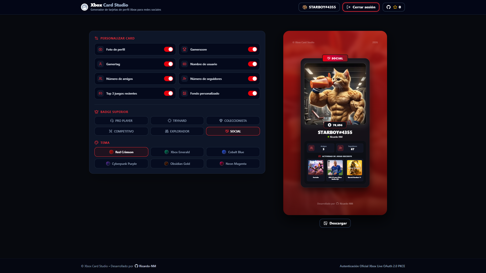

# Xbox Card Studio

> Generador web moderno e interactivo de tarjetas de perfil personalizadas de **Xbox Live** en alta resolución, diseñadas especialmente para compartir en redes sociales (Instagram, TikTok, Twitter/X, Discord, WhatsApp).



---

## ¿Qué es Xbox Card Studio?

**Xbox Card Studio** es una herramienta web creada para la comunidad gamer que permite sincronizar tu perfil oficial de Xbox y personalizar manualmente una tarjeta de jugador con estética premium. La tarjeta cuenta con un formato 9:16 nativo, degradados dinámicos, insignias personalizadas, métricas de juegos y estadísticas reales.

### Características principales

- **Conexión directa con Xbox Live**: Inicia sesión de forma segura con tu cuenta de Microsoft para importar automáticamente tu información.
- **Estudio de personalización**:
  - Cambia entre múltiples temas visuales.
  - Selecciona insignias personalizables.
  - Alterna interruptores dinámicos para mostrar u ocultar tu información.
- **Descarga en alta resolución**: Exporta tu tarjeta directamente en formato JPEG optimizado con un solo clic.

---

## Seguridad y privacidad del login de Xbox (OAuth 2.0 PKCE)

Me gustaría dejar **100% claro que Xbox Card Studio es un sistema totalmente seguro** y transparente que respeta la privacidad de los usuarios:

1. **Autenticación oficial de Microsoft**:
   Al hacer clic en _Iniciar sesión_, serás redirigido directamente a los servidores oficiales de Microsoft (`login.live.com`). Tu contraseña o datos de inicio de sesión se ingresan exclusivamente dentro del dominio seguro de Microsoft. **Está aplicación jamás ve, solicita ni almacena tu contraseña.**

2. **Permisos de solo lectura (Read-Only)**:
   La aplicación utiliza el flujo oficial OAuth 2.0 con PKCE (_Proof Key for Code Exchange_) y únicamente solicita el alcance de lectura estándar `XboxLive.signin`. No tiene permisos para modificar la cuenta, cambiar datos, enviar mensajes ni realizar transacciones.

3. **Procesamiento 100% en el cliente (Zero backend data storage)**:
   Todo el proceso de autenticación e importación de datos se ejecuta de manera local dentro de tu navegador web. **No se almacenan tokens, credenciales ni información del usuario en ninguna base de datos externa ni servidor.** Al cerrar sesión o recargar, los tokens de sesión se limpian.

---

## Tecnologías utilizadas

- **Core**: React 19 & Vite 8
- **Estilos**: TailwindCSS v4 & Lucide Icons
- **Autenticación**: Microsoft Entra ID (OAuth 2.0 + PKCE)
- **APIs oficiales**: Xbox Live Profile API, TitleHub API & Social Graph API
- **Exportador de imagen**: `html-to-image`

---

## Instalación y configuración Local

Si deseas ejecutar el proyecto localmente o contribuir:

1. **Clonar el repositorio**:

   ```bash
   git clone https://github.com/Ricardo-NM/XboxCard.git
   cd XboxCard
   ```

2. **Instalar dependencias**:

   ```bash
   npm install
   ```

3. **Configurar las variables de entorno**:
   Copia el archivo `.env.example` a `.env`:

   ```bash
   cp .env.example .env
   ```

   Abre el archivo `.env` y asigna tu Client ID de Microsoft Entra:

   ```env
   VITE_AZURE_CLIENT_ID=tu_client_id_aqui
   ```

4. **Iniciar el servidor de desarrollo**:

   ```bash
   npm run dev
   ```

5. **Compilar para producción**:
   ```bash
   npm run build
   ```

---

## Contribuciones

¡Las contribuciones son más que bienvenidas! Si tienes ideas para mejorar la aplicación, nuevos temas visuales, corrección de errores o sugerencias de nuevas características:

1. Haz un **Fork** del proyecto.
2. Crea una rama para tu mejora (`git checkout -b feature/nueva-funcionalidad`).
3. Realiza tus cambios y confirma los commits (`git commit -m 'Agrega nueva funcionalidad'`).
4. Envía tus cambios a tu repositorio fork (`git push origin feature/nueva-funcionalidad`).
5. Abre un **Pull Request** explicando tus cambios para revisarlo e integrarlo.

¡Todo aporte, feedback o reporte de _issues_ es muy apreciado por la comunidad!

---

## Autor

Desarrollado con ❤️ por **[Ricardo-NM](https://github.com/Ricardo-NM)**.
